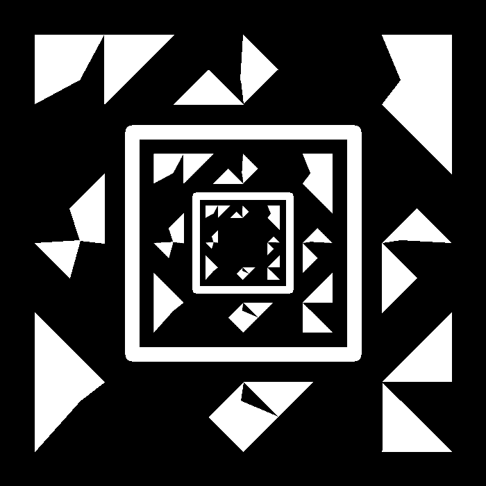
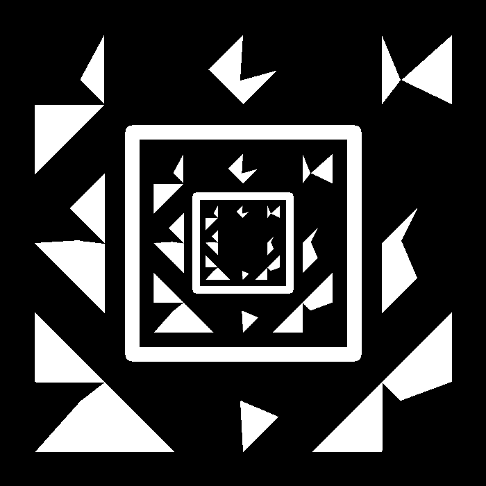
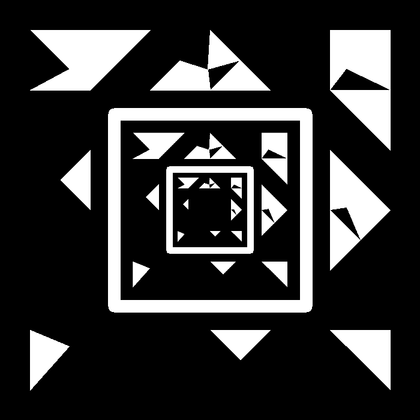
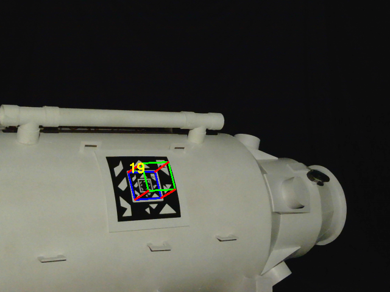
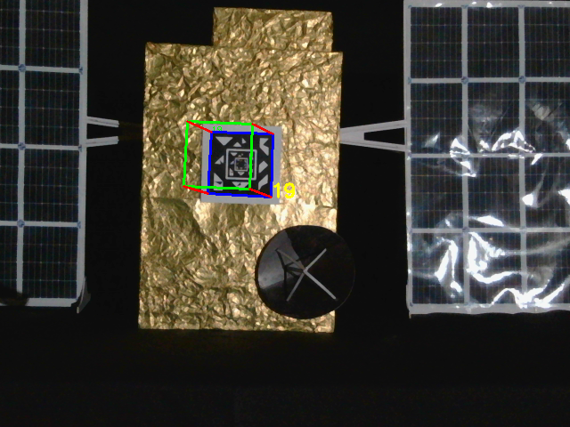

# AstraTag
### Multi-Range Fiducial Marker for Spacecraft Rendezvous, Proximity Operations and Docking

This repository contains the implementation of multi-range, recursive fiducial marker AstraTag. The marker template is derived from square shaped Spidron. The marker is designed for in-orbit operations around cooperative targets. The objective of introducing recurisve feature is to make it suitable for conducting rendezvous and proximity operation. Its three layers provide robustness against a partial occlusion. Below are some of the sample markers. 

<div style="display: flex; justify-content: space-between;">
    
    
    
</div>

To test the marker, a space-like environment was created using a pair of mock-up spacecraft. The mock-ups, inspired by the Aditya-L1 spacecraft and the Indian Space Station module BAS-01, were used as targets. The images below demonstrate a sample result. The setup was placed on a turntable to simulate out-of-plane rotation.

<div style="display:flex; flex-direction:row; justify-content:center; gap:12px; align-items:flex-start; flex-wrap:nowrap;">
   
   
</div>

AstraTag markers can also be used in robotics application in terrestial and underwater environments. 

### Requirements

- C++17 or later
- OpenCV 4.x (required by CMake)
- CMake 3.16 or later
- A standard build toolchain (gcc/clang, make)

Quick build (recommended)
1. Clone the repository and create a build directory:

```bash
git clone https://github.com/ravikt/astratag.git
cd astratag
mkdir build && cd build
cmake ..
make -j$(nproc)
```

```bash
# from project root
./build/astratag_detect

# or from build/
./astratag_detect
```

- The example expects a few folders/files by default (see `examples/detect_tags.cpp`):
  - `astratag_data/` : input images to process (create or replace with your own)
  - `results/`       : output folder where processed frames are written
  - `data/new_dictionary.json` : marker dictionary used by the detector
  - `config/camera_example.json` : camera intrinsics used for pose visualization

Project Structure
```
astratag/
├── CMakeLists.txt                 
├── include/                       
├── src/                           
│   ├── quadrilateral.cpp
│   ├── detector.cpp
│   ├── signature.cpp
│   ├── visualization.cpp
│   └── main.cpp                    
├── examples/
│   └── detect_tags.cpp            
├── data/                           
├── config/                        
├── sample/                        
├── scripts/                                                
```


### License
See `LICENSE` in the repository root for license terms.

