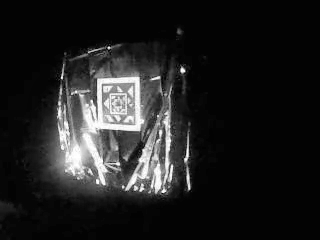
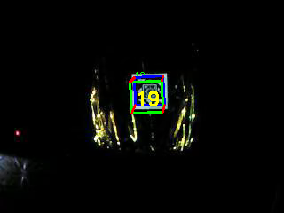

# AstraTag
### Multi-Range Fiducial Marker for Spacecraft Rendezvous, Proximity Operations and Docking

This repository contains the implementation of multi-range, recursive fiducial marker AstraTag. The marker template is derived from square shaped Spidron. The marker is designed for in-orbit operations around cooperative targets. The objective of introducing recurisve feature is to make it suitable for conducting rendezvous and proximity operation. Its three layers provide robustness against a partial occlusion. Below are some of the sample markers. 

    
    
    

To test the marker, a space like ligthing condition was created. A cube shaped box was used as a mock-up spacecraft. The images below demonstrates a sample result. The setup is placed on turntable to simulate out-of-place rotation. 

AstraTag markers can also be used in robotics application in terrestial and underwater environments. 